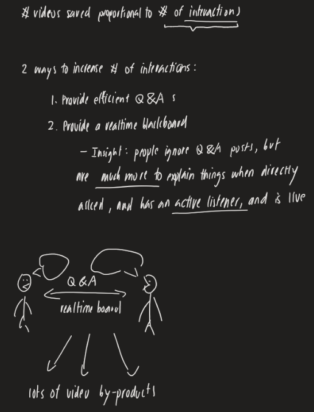

# ExplainMIT 

ExplainMIT is a website where MIT students, TAs and professors share visual explanations

## Problem
1. Help is a scarce resource (long queues in Office Hours, vague answers in Piazza, hard to find study partners)
2. There are 2 ways to alleviate scarcity: have more people help, or have more explanation videos ("store" past help)
3. 1st option requires behavioral distortion; 2nd option requires heavy time commitment. 

## Insight
1st option can be addressed (it's possible to shift behavior in people to help each other more)
- People never post videos, but people explain things in-person live all the time. Why?
- Because the latter is need-based, in response to an active listener, effective (can draw on a blackboard), and much more rewarding
- What if people have more opportunities to explain things on a blackboard live more often without geographic barriers and social barriers (i.e. live in same place, know each other)

2nd option can be addressed (it's possible to create videos efficiently with little overhead)
- Answering questions take far less time if the user can draw and talk at the same time like in real life
- What if people can talk while drawing with iPads, mouse? 
- Instead of throwing the explanations away after each in-person interaction, what if we can preserve what's there already?

## Solution
1. Maximize interactions with a visual Q&A platform equipped with realtime blackboards
  - People are most willing to explain things if:
    - Social reward from live listener feedback is very engaging
    - They feel that their help is scales and is economical
    - If it is efficient and convenient (i.e. typing on messenger back and forth is not efficient) 

2. Minimize the cost of making videos with a website optimized for blackboard videos
- "Oops, I accidentally made a video": can just save the explanation you made as a video
- Instantaneous video upload time and no management of files (on Youtube it takes a few minutes) 

ExplainMIT is a website where helping one person is no different than helping everyone - because all explanations can be archived and reused. (TODO: add product specs)

## Contributions
Our stack is Vue, Vuetify and Firebase. For those interested to contribute, please read [CONTRIBUTING.md](documentation/CONTRIBUTING.md)

**Current contributors** (photos incoming)
We're a student organization. Our primary goal is to help make learning fun and efficient at MIT. If we succeed, we will consider expanding to other universities as a startup. 
- Harry Liu 
- Prabhakar Kafle
- Lujing Cen
- Samir Droubi
- Winston Fey
- Elton Lin

**Past contributors**
- Hubert Wasilewski was the backend engineer back in the early days 
- Tony Wang built the slider for traversing any video freely 
- Yang Yang worked on email notifications
- John Lin worked on the voice chat and copy-image-to-chat feature
- Kirill Zabrodin improved the README, set up deployment tests and added the copy-to-clipboard feature for sharing video links
- Kyle Xiao worked extensively the Q&A feature
