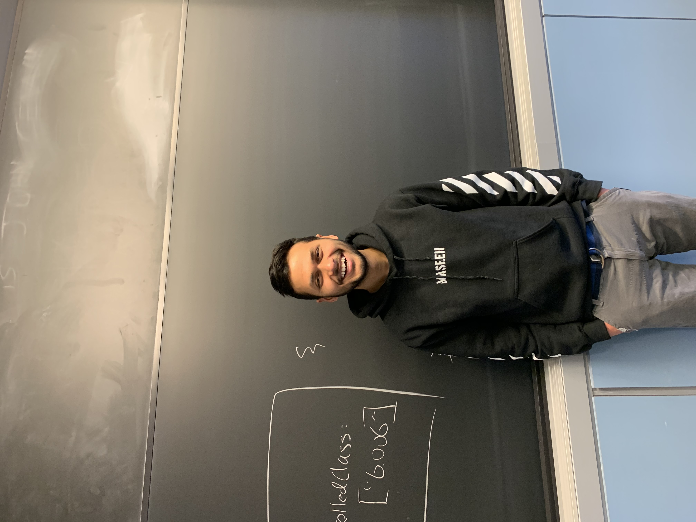

# ExplainMIT
The Explain Project will create the most efficient explanation platform for MIT, so that no one has to stay up late and study alone.

## Technology
Explanation videos are 10-50x lighter (https://explain.mit.edu) because we represent them with sparse blackboard strokes rather than exhaustive pixel colors. Here are some consequences: 
- Upload time is 10x faster 
- Sliding to any part of a video requires no buffering
- Visual explanations is a first-class citizen of the website's structure, and is just as easy to create and share as text

## Team
We are students with the goal to achieve MIT-wide adoption of explain.mit.edu. The day that becomes reality, we plan to create a separate codebase and transition into a startup. 

Current members: 
- Prabhakar Kafle
- Winston Fee
- Elton Lin

We are recruiting (email eltonlin@mit.edu)!

  
  

## [CONTRIBUTING.md](documentation/CONTRIBUTING.md)
- **Technologies:** Vue.js frontend, Firebase for everything else
                                                                    

                                                                    
                                                             
