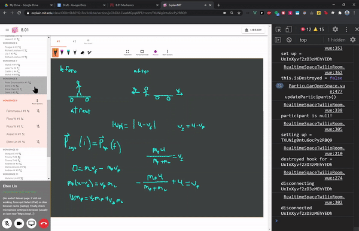

# Explain
>Explain is an experimental web prototype with the mission of forging a vibrant, electrifying community at MIT where everyone helps each other. It is part of Project Feynman, a plan to accelerate world education and end poverty, pollution and injustice.

## Plan
**Step 1/3: Create a vibrant, electrifying community at MIT where everybody helps each other**
This will involve an open-source, experimental prototype that drastically increases learning efficiency. It will also involve creating a system where, no matter how behind anyone feels, they'd know that there is an army of classmates and TAs who would jump at the opportunity to help out. Everything happens recursively, students use Explain to pset better, developers use Explain to develop Explain, even professors can contribute and change the code with anything. It's the entire school coming together to help each other. 

**Step 2/3: Create a startup that becomes the grand explanation platform for the world**
This will involve democratizing education so everyone regardless of their circumstances can access the best resources for free, therefore increasing their potential to change the world. 

**Step 3/3: End poverty and pollution by 2035**
Education is ultimately a "sword" that needs to be directed at our most urgent problems. 

For more details, see [here](https://docs.google.com/document/d/15d4Ne4K5kRBuu-1EAcrBSDLQqzLtuVP3zg6iujNnEdE/edit)
 
## How to join
Explain is open source and recruiting people of all of levels. For more information, check out [CONTRIBUTING.md](documentation/CONTRIBUTING.md).  

## Acknowledgements
Special thanks to Prabhakar, Winston, Tony and Dr Dourmashkin. The more complete list is [here](documentation/ACKNOWLEDGEMENTS.md)
